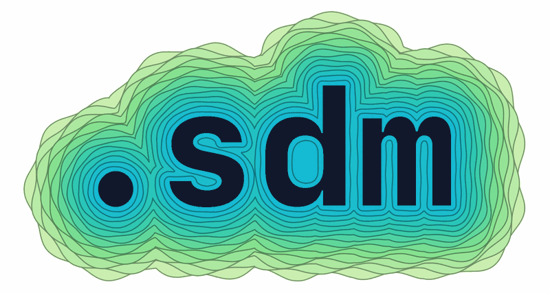
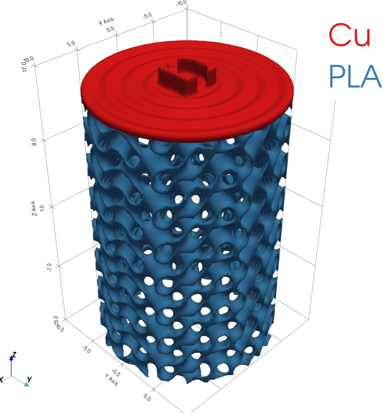
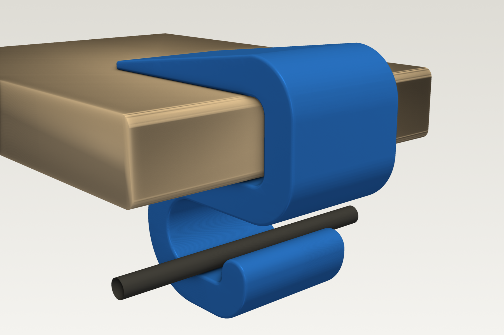
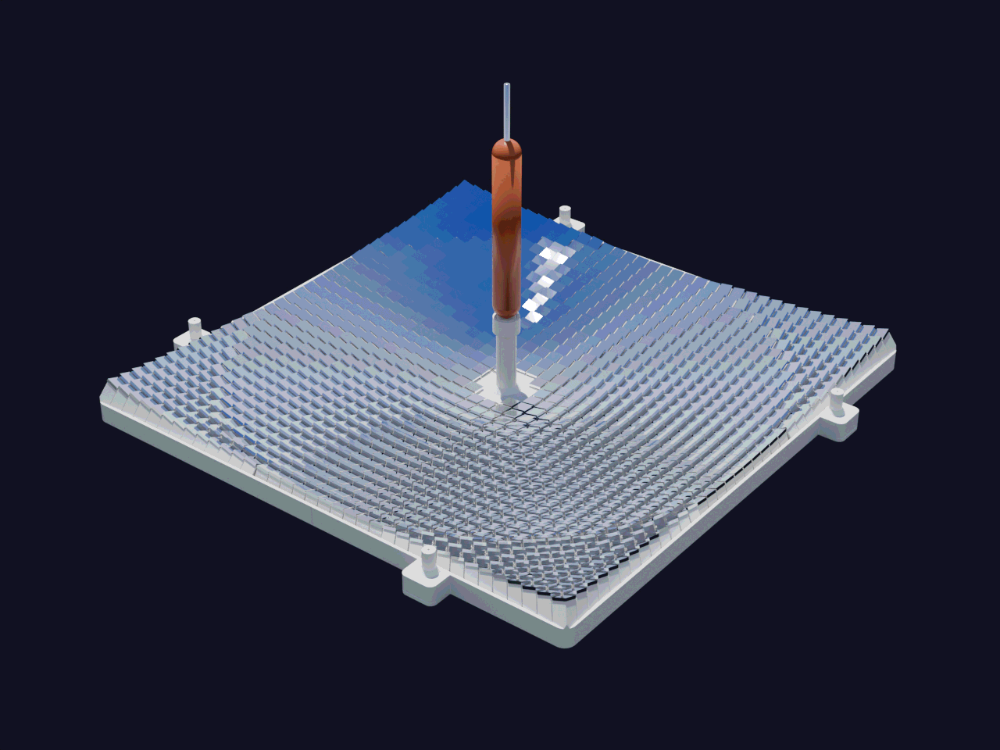

<a id="readme-top"></a>

<p align="center"></p>

# Software Defined Matter

[](LICENSE)
[](https://www.python.org/downloads/)
[](https://docs.astral.sh/uv/)

**Software Defined Matter (SDM)** is an engineering framework designed for agentic AI systems: the entire path from specification to working machine is designed and executed by software, and the final output is a physical, multi-material object, manufactured directly from the optimized design.

```
Specification → 3D Model → Simulation / Optimization → Manufacturing Process → Machine
```

Instead of hand-authored CAD files, geometry is expressed as **parametric code**: signed distance fields that compile to JAX functions. Because the geometry, the objectives, and the constraints are all differentiable, the *entire design loop* is one autodiff graph. Gradients flow from a physics objective back through the shape parameters, and the optimized result exports as machine-ready meshes and related file formats. CAD evolved.

The output of every design is a `.sdm` file: a portable, standardized JSON description of shapes, materials, objectives, constraints, and part couplings that any tool in the ecosystem can consume. See [Concepts](docs/concepts.md) for how a design becomes a `.sdm` file and how `sdm-core` evolves it from there.


---

## A multi-material part, defined entirely in code



A hollow cylinder with a gyroid infill, a copper hinge, and a PLA shell, in one part with no mesh authoring.

## Install

Other than the provided simple examples, this repository (`emergent-matter-sdm`) is documentation only; there's nothing to install here.

`sdm-core` and the packages it depends on are published to the Software Defined Matter package index, not PyPI. Browse the packages, versions and file hashes at [get.softwaredefinedmatter.com](https://get.softwaredefinedmatter.com/), and install from its index:

```bash
uv pip install emergent-matter-sdm-core --index https://get.softwaredefinedmatter.com/simple
```

That also installs [`emergent-matter-sdm-materials`](https://github.com/EmergentMatter/emergent-matter-sdm-materials), the materials catalog `sdm-core` reads properties from. In a uv project, declare the index once and pin our packages to it, so their names never resolve from public PyPI:

```toml
[[tool.uv.index]]
name = "em"
url = "https://get.softwaredefinedmatter.com/simple"
explicit = true

[tool.uv.sources]
emergent-matter-sdm-core = { index = "em" }
emergent-matter-sdm-materials = { index = "em" }
```

To work on `sdm-core` itself, clone it and run `uv sync`:

```bash
git clone https://github.com/EmergentMatter/emergent-matter-sdm-core.git
cd emergent-matter-sdm-core
uv sync
```

## Quick start

A copy-pasteable example, once installed. It builds the part shown above and writes it to a `.sdm` file:

```python
from software_defined_matter import (
    MaterialRegion,
    Param,
    Part,
    make_param_ref,
    sdf_op,
    sdf_primitive,
    sdf_transform,
)
from software_defined_matter.io import save

# Excerpted from examples/build_example.py in sdm-core; the full example
# also declares couplings, an objective, and constraints.
p_outer_r = Param("outer_radius", 20.0, free=True, bounds=(10.0, 40.0), unit="mm")
p_inner_r = Param("inner_radius", 14.0, free=True, bounds=(6.0, 30.0), unit="mm")
p_notch_r = Param("notch_radius", 3.0, free=True, bounds=(1.0, 6.0), unit="mm")

outer_cyl = sdf_primitive("capped_cylinder", h=30.0, r=make_param_ref("outer_radius"))
inner_cyl = sdf_primitive("capped_cylinder", h=30.0, r=make_param_ref("inner_radius"))
shell = sdf_op("subtract", [outer_cyl, inner_cyl])

gyroid_infill = sdf_primitive("gyroid", period=8.0, min_thickness=1.0, n_periods=[10, 10, 8])
infilled = sdf_op("intersect", [shell, gyroid_infill])

hinge = sdf_primitive(
    "notch_hinge", width=8.0, depth=8.0, notch_radius=make_param_ref("notch_radius")
)
hinge_placed = sdf_transform("translate", hinge, t=[0.0, 0.0, 30.0])

part = Part(
    name="hollow_cylinder_with_hinge",
    params={p.name: p for p in [p_outer_r, p_inner_r, p_notch_r]},
    materials=[
        MaterialRegion(material_id=1, name="Cu", sdf_tree=hinge_placed),
        MaterialRegion(material_id=2, name="PLA", sdf_tree=infilled),
    ],
)
save(part, "hollow_cylinder_with_hinge.sdm")
```

Run `uv run python examples/build_example.py` in `emergent-matter-sdm-core` for the fuller version: it adds the textured top flange, an objective, constraints, and coupling nodes, and is what produced the render above. What you just wrote is the seed of a **Computational Engineering Model (CEM)**: the code repository that describes one part or system, uses `sdm-core` to turn that description into a `.sdm` file, and is the unit you iterate on when working with SDM. When it needs a repository of its own, start from [`emergent-matter-sdm-cem-template`](https://github.com/EmergentMatter/emergent-matter-sdm-cem-template), a complete CEM that builds, validates, and has passing tests.

---

### More examples

Each one lives in [`examples/`](examples/), runs from a clone, and checks in its `.sdm` file so you can open the part without building it.

|  |  |
|---|---|
|  | **Backpack desk hook, checked with FEA**<br>A fastener-free clamp-on hook, analysed with [jax-fem](https://github.com/deepmodeling/jax-fem) before printing: 2-D plane stress across 12 slicer settings, a 3-D check for the narrow handle and the layer bonds, and safety factors per load case. Every mesh is cut from the `.sdm`'s own distance field. Printed solid in PLA it holds a 19 kg bag 24/7; with 40 % gyroid infill, 7 kg. [examples/emergent-matter-cem-backpack-desk-hook](examples/emergent-matter-cem-backpack-desk-hook/) |
|  | **Solar hot-dog cooker**<br>Four printed plates carrying 1284 glued-on mirrors, each pad tilted by the law of reflection so the sunlight spreads evenly along the dog: 84 W, flat to 2 %, ray-traced against the SDF. One quadrant is authored and folded 4-fold. [examples/emergent-matter-cem-hot-dog-cooker](examples/emergent-matter-cem-hot-dog-cooker/) |
|  | **Functionally graded multi-material**<br>A bar that is one solid piece of two materials, graded across the join rather than joined: composition follows the erfc solution of Fick's second law for a diffusion couple, and asymmetric diffusivities are a slider. [examples/emergent-matter-cem-multi-material-diffusion](examples/emergent-matter-cem-multi-material-diffusion/) |

---

## Documentation

New to SDM? Start with [Concepts](docs/concepts.md) for what it is and how the pieces fit together, then the [Quick start](#quick-start) above to build your first `.sdm` file. [Architecture](docs/architecture.md) covers the wire format and data flow, and [Ecosystem](docs/ecosystem.md) maps every repository in the pipeline. The rest of `docs/` is indexed by name.

## Core repositories

`sdm-core` is the reference implementation. A separate materials substrate supplies multi-physics properties, and a manufacturing substrate supplies process and machine constraints. See [Ecosystem](docs/ecosystem.md) for the full repository map, the CEM examples, and how they relate.

---

## Conventions

- **Geometry is in millimeters**; all other quantities are base SI.
- **The SDF is the source of truth.** Meshes are always derived artifacts, generated at export time, never hand-authored or edited.
- Export defaults to marching cubes (robust, watertight); a JAX-native dual-contouring path exists but is experimental.

---

## FAQ

### How does SDM relate to CAD? Does it replace it?

SDM changes what the source of truth is. In CAD the source of truth is the final shape, a B-rep or a mesh, and everything that led to that shape lives somewhere else. In SDM the source of truth is code: an `.sdm` part carries the parameters, materials, objectives, constraints, and couplings that produced the geometry, and the geometry itself is a differentiable signed distance field that any tool can sample. That is what lets an optimizer move a wall thickness against a physics objective, and what lets an agent read and change design intent directly instead of inferring it from bare geometry.

For the parts you design with it, that does replace day-to-day CAD authoring. It does not replace CAD as an interchange layer. Every design still leaves as machine-ready meshes and related file formats, and parts that only exist as CAD geometry, such as vendor catalog components, still join an assembly through a CAD layer rather than being re-modelled. SDM is a design and engineering framework, not a drawing format.

### Why signed distance fields instead of B-rep or meshes?

Because an SDF compiles to a pure function: geometry you can sample anywhere, differentiate with respect to design parameters, and optimize with gradients. Boolean operations that are fragile on B-rep are trivial and robust on SDFs, and structures like lattice infill that are impractical to author in CAD are a few lines of code. Meshes still exist in the pipeline, but only as derived artifacts, generated at export time from the SDF source of truth.

### Is the `.sdm` format tied to sdm-core?

No. An `.sdm` file is schema-validated JSON with a versioned schema, so any tool (an optimizer, a viewer, a solver, an agent) can read and write it. `sdm-core` is the reference implementation, not a gatekeeper.

### Why open source?

The Emergent Matter team believes that we are more powerful as a community, fostering adoption and building value around the resulting ecosystem. We want engineers, developers, and anyone with an idea that requires exploration and optimization to own their own files and designs, and to be unbounded by any current limitations of the SDM framework. We aim to break down the barriers of vendor lock-in and existing template-bound design software by giving away core ideas, and leveraging them to build a movement. We intend to maintain Software Defined Matter as a meeting place and methodology for like-minded people who want to help us change the way machines are designed and built. We appreciate feedback along the way, and welcome bug reports, issues, feature requests, and pull requests from the computational design and engineering community, so that together we can build SDM as a substrate and central interchange for computational engineering ideas.

---

## Built with

| | |
|---|---|
| [NumPy](https://numpy.org/) | Mesh generation for the primitives-showcase renders |
| [Blender](https://www.blender.org/) | Headless rendering of the primitives showcase board above |
| [ImageMagick](https://imagemagick.org/) | Stitching the tiled print-resolution renders of the showcase board |
| [uv](https://docs.astral.sh/uv/) | Packaging and the locked dev environment |

## Contributing

See [CONTRIBUTING.md](CONTRIBUTING.md) for how a change ships: the
changeset a pull request needs, what counts as major, minor, or patch,
and how a release is cut. [STYLE.md](STYLE.md) is the house style for
code, tests, and docs, and it wins over habit.

By participating you agree to the
[Code of Conduct](CODE_OF_CONDUCT.md).

## Support

Questions and usage help go to
[Discussions](https://github.com/EmergentMatter/emergent-matter-sdm/discussions);
bugs and feature requests go to
[Issues](https://github.com/EmergentMatter/emergent-matter-sdm/issues).
See [SUPPORT.md](SUPPORT.md) for what is and is not supported.

For security reports, do not open a public issue. Follow
[SECURITY.md](SECURITY.md).

## License

Apache-2.0. See [`LICENSE`](LICENSE) and [`NOTICE`](NOTICE).

## Acknowledgments

[CODE_OF_CONDUCT.md](CODE_OF_CONDUCT.md) is adapted from the [Contributor
Covenant](https://www.contributor-covenant.org/version/2/1/code_of_conduct.html),
version 2.1, licensed under CC BY 4.0; see [`NOTICE`](NOTICE) for the full
attribution. For the lineage of the SDF primitives and TPMS lattice
families rendered above, see
[sdm-core's Acknowledgments](https://github.com/EmergentMatter/emergent-matter-sdm-core#acknowledgments).

<p align="right">(<a href="#readme-top">back to top</a>)</p>
