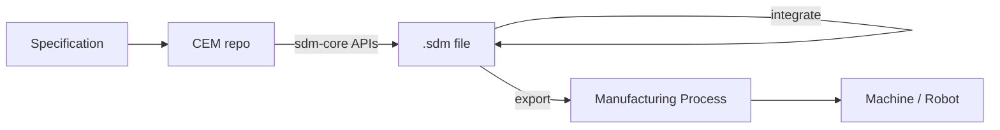

# SDM Architecture

## System overview

## The `.sdm` file

The `.sdm` file is the central data artifact. It is a JSON document that contains:

- **Geometry**: a tree of SDF nodes (primitives, operations, transforms)
- **Parameters**: named scalar values with bounds and units
- **Materials**: material assignments per geometry region
- **Objectives**: cost functions to minimize/maximize
- **Constraints**: hard constraints that must be satisfied
- **Couplings**: declared interfaces to other parts
- **Snapshots**: versioned history of design states

The JSON schema is generated from `sdm-core`'s wire contract rather than hand-maintained, so it can't drift from what the library actually reads and writes. See [ADR 0001](https://github.com/EmergentMatter/emergent-matter-sdm-core/blob/main/docs/adr/0001-sdm-wire-contract.md) and `docs/schema-versioning.md` in `sdm-core` for how a schema version is cut and frozen.

## Design principles

- **JAX SDF is the single source of geometric truth**: geometry never lives in a mesh or CAD file at design time
- **Autodiff from day one**: all geometry and physics must be cost-function-compatible
- **Layered separation**: Core (pure JAX/Python) → Orchestration (`.sdm` JSON) → Host app (viewer/export)
- **Manufacturing-process agnostic**: the export layer targets whatever process a part's metadata declares; a specific CEM may commit to one process (print-in-place powder bed fusion, for example), but the format and the optimization loop don't assume it

## Data flow through the ecosystem

A CEM produces an `.sdm` file using `sdm-core`, which reads material properties from `emergent-matter-sdm-materials` and manufacturing-process constraints from `emergent-matter-sdm-processes` while it optimizes and validates. From there the `.sdm` file forks two ways: a viewer (`emergent-matter-sdm-view`, the Blender layer) renders it for inspection and external physics back-ends (FEA (finite element analysis) and EM (electromagnetic) solvers) simulate it, before export targets a manufacturing process. See [Ecosystem](ecosystem.md) for the full repository map and its diagram.
