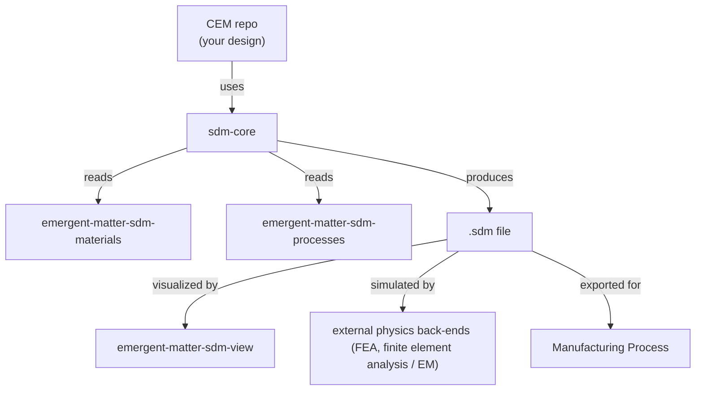

# The SDM Ecosystem

The SDM ecosystem is a collection of repositories at [EmergentMatter](https://github.com/EmergentMatter) that together implement the full pipeline from specification to manufactured part.

## Core infrastructure

| Repo | Description |
|------|-------------|
| [emergent-matter-sdm-core](https://github.com/EmergentMatter/emergent-matter-sdm-core) | Core Python library: SDF primitives, `.sdm` file format, optimization, export |
| [emergent-matter-sdm-materials](https://github.com/EmergentMatter/emergent-matter-sdm-materials) | Unified multi-physics materials substrate: structural, EM (electromagnetic), thermal, manufacturing properties with per-property provenance |
| [emergent-matter-sdm-processes](https://github.com/EmergentMatter/emergent-matter-sdm-processes) | Manufacturing process / machine capability substrate: process families and machine-specific presets |

## Physics and visualization

| Repo | Description |
|------|-------------|
| [emergent-matter-sdm-physics](https://github.com/EmergentMatter/emergent-matter-sdm-physics) | Physics layer: the `sdm-traj` trajectory contract and Beam Constraint Model flexure solvers |
| [emergent-matter-sdm-view](https://github.com/EmergentMatter/emergent-matter-sdm-view) | Blender authoring and visualization layer for SDM geometry |

## Computational Engineering Models (CEMs)

CEMs use `sdm-core` to define, optimize, and export parts. Start from [emergent-matter-sdm-cem-template](https://github.com/EmergentMatter/emergent-matter-sdm-cem-template), and see the worked examples under [`examples/`](../examples/) in this repository.

## How the repos relate

