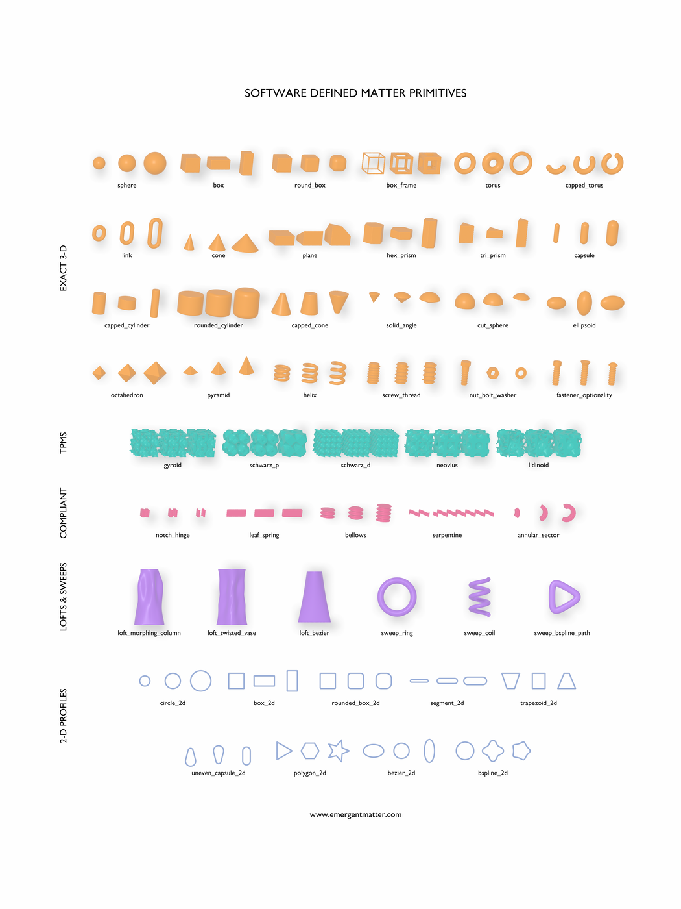

# sdm-core

`sdm-core` is the Python library the rest of the ecosystem is built on. A
CEM uses it to standardize a design into an `.sdm` file; the optimizer,
viewer, and export paths in the [ecosystem](ecosystem.md) all read what it
wrote. Source: [`emergent-matter-sdm-core`](https://github.com/EmergentMatter/emergent-matter-sdm-core).

## Where it sits

See [Architecture](architecture.md) for how Core, Orchestration, and the
host apps divide the pipeline; `sdm-core`'s own
[`docs/architecture.md`](https://github.com/EmergentMatter/emergent-matter-sdm-core/blob/main/docs/architecture.md)
covers its directory structure, and its README's
[What is intentionally outside core](https://github.com/EmergentMatter/emergent-matter-sdm-core/blob/main/README.md#what-is-intentionally-outside-core)
covers what it deliberately leaves out.

## Why SDF, not B-rep

See the README FAQ: [Why signed distance fields instead of B-rep or
meshes?](../README.md#why-signed-distance-fields-instead-of-b-rep-or-meshes).

## The primitive catalog

The full primitive catalog at a glance: every primitive shown with three
parameter perturbations, color-coded by family (exact 3-D solids, TPMS lattices,
compliant mechanisms, 2-D profiles, and lofts/sweeps). Generated directly from
`sdm-core` by the [primitives showcase](../src/sdm_showcase/README.md).

## Reference

`sdm-core`'s docstrings are the reference: they're reviewed with the code
they describe, so they can't drift from it the way a second copy would.

- `sdf_primitive`, `sdf_op`, `sdf_transform`, and `Part` are defined in
  [`model.py`](https://github.com/EmergentMatter/emergent-matter-sdm-core/blob/main/src/software_defined_matter/model.py).
- The primitive, operation, and transform catalogs live under
  [`sdf/`](https://github.com/EmergentMatter/emergent-matter-sdm-core/tree/main/src/software_defined_matter/sdf).
- The `.sdm` file format is documented in
  [ADR 0001](https://github.com/EmergentMatter/emergent-matter-sdm-core/blob/main/docs/adr/0001-sdm-wire-contract.md)
  and [`docs/schema-versioning.md`](https://github.com/EmergentMatter/emergent-matter-sdm-core/blob/main/docs/schema-versioning.md).
- Optimization is documented in
  [`docs/optimization.md`](https://github.com/EmergentMatter/emergent-matter-sdm-core/blob/main/docs/optimization.md):
  what is differentiable, choosing an optimizer, and the bounding box as
  metric sampling domain.
- Export targets and the manufacturing-fidelity mesh path live under
  [`export/`](https://github.com/EmergentMatter/emergent-matter-sdm-core/tree/main/src/software_defined_matter/export).
