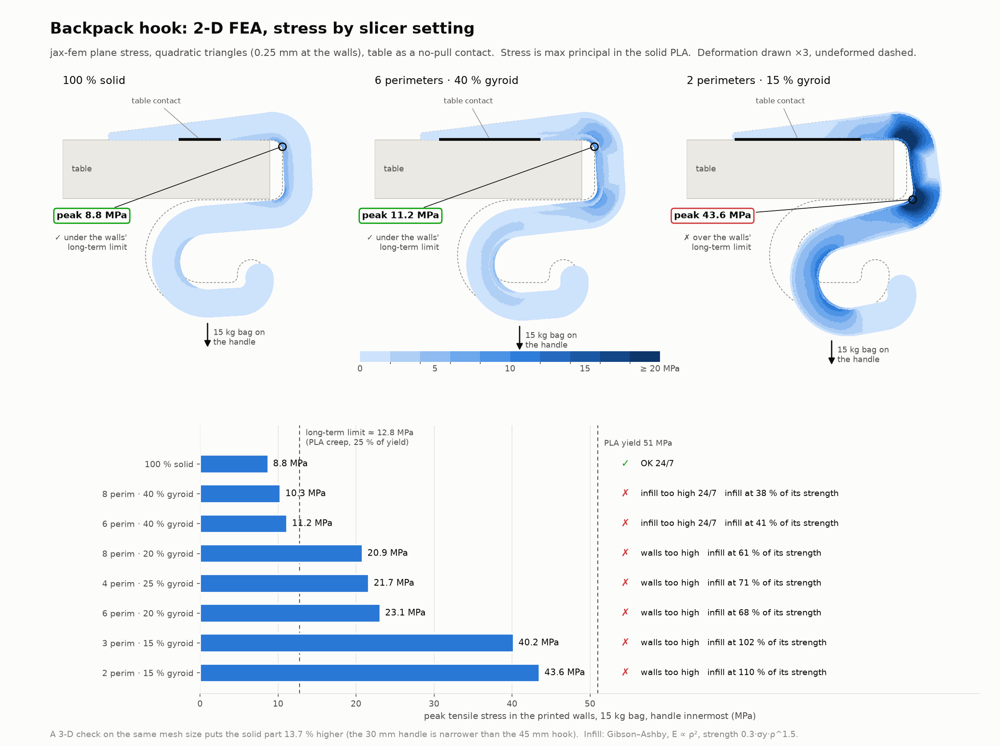
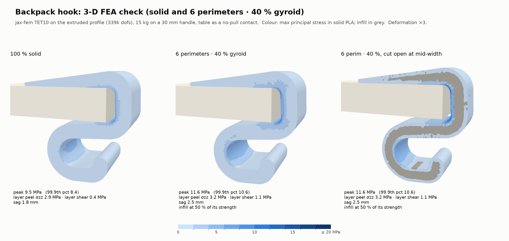
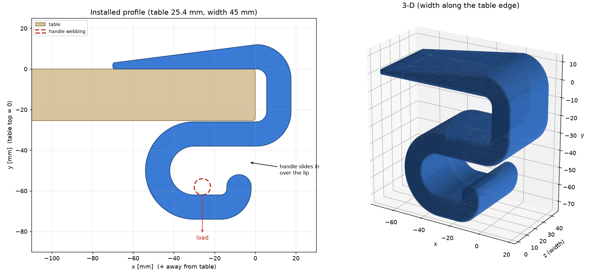
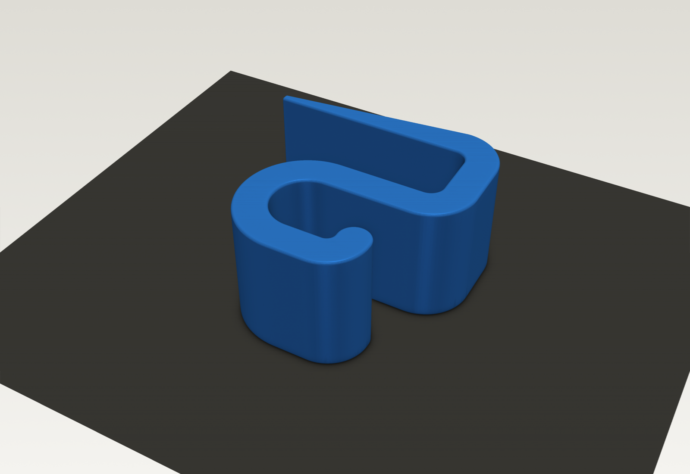
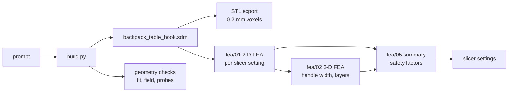

# Backpack desk hook: a part checked with FEA before it is printed


A clamp-on hook for a desk edge, written as a parametric `.sdm` part with
[`sdm-core`](https://github.com/EmergentMatter/emergent-matter-sdm-core) and
checked with [jax-fem](https://github.com/deepmodeling/jax-fem) before
printing. It uses no fasteners. The shape is one continuous bent bar: a thin
tapered bar rests on the desk, bends down the edge, runs back under the desk
as a jaw, and loops into a rounded hook for a backpack's top handle.

It is a **CEM**, a computational engineering model: parameters in, geometry
out. It lives in `examples/` rather than its own repo, but it is named to the
`emergent-matter-cem-*` convention so promoting it later is a move, not a
rename.

The example covers the whole loop from a plain-language prompt to a verified
print file:

**prompt → parametric `.sdm` → geometry checks → 2-D and 3-D FEA → safety factors → slicer settings**

| | |
| --- | --- |
| The part | [`backpack_table_hook.sdm`](backpack_table_hook.sdm): 13 params, every dimension a `$ref` expression over them |
| Material and process | Prusament PLA, FDM on a Prusa Core One, printed on its side, no supports |
| Built for | a desk 25.4 mm thick with ~3.25 mm edge rounds |
| Verdict | **Print it 100 % solid** for a heavy bag that lives on the hook. 6 perimeters with 40 % gyroid is fine only for light bags (see [Results](#results)). |

## What this example shows about SDM

- **The FEA reads the part, not a copy of it.** Every mesh the solver uses
  is cut from the `.sdm`'s own distance field, so editing a param and
  re-running the workflow re-checks the part you will actually print. No
  CAD export sits between the design and the analysis.
- **A slicer setting is part of the design.** Printed on its side, every
  layer is a copy of the profile, so the 2-D model can give each point the
  stiffness of what the slicer puts there (perimeter walls, solid skins,
  gyroid core) and compare 12 settings on one geometry.
- **A distance field that is exact on purpose.** The profile is a single
  polygon, so the field is exact everywhere, and the build measures it.
  That is what lets one `round` modifier put a true radius on every edge
  (see [How the geometry is built](#how-the-geometry-is-built)).
- **Design intent survives in the file.** Every dimension is stored as an
  expression over the params, not as a number, so the `.sdm` can be resized
  for another desk without re-running the build.

## The prompt

The part came from this prompt to Claude Code, quoted as typed
(2026-09-24). Everything after it was iteration:

> I want to build with software defined matter. The part I want is a backpack
> holder that will be FDM printed on the pruse core 1 in PLA. The hook should be
> able to handle a load of a heavy standard backpack, however instead of hanging
> from fasteners, I want it in a "C" shape that hooks the top of the table and
> supports the weight with a thin bar on the top side of the table, then loops
> back under it to provide the rounded hook to catch the top handle on a
> backpack. Start the design now.

The FEA came from this follow-up:

> okay, what infill setting should I use? Did you do the basic FEA? How about you
> grab jax-fem (the open source project, I have it on disk already), and run the
> FEM and let me know if I need to print this solid PLA (prusamet) or if I can do
> sparse infill on my slicer...

And the final fit came from this one, after measuring the desk:

> desk is 25.4mm so do that but leave some tolerance space as well. Also the
> radii are about 3.25mm so make sure we don't over-blend our radii. Rerun FEA if
> needed

## Results





Peak stresses with a 15 kg bag, after the 3-D correction for the narrow
handle:

| At 15 kg | 100 % solid | 6 perimeters · 40 % gyroid |
| --- | --- | --- |
| Peak wall tension | **10.0 MPa** (8.76 × 1.137) | **12.4 MPa** (11.19 × 1.107) |
| Infill, share of its own strength | – | **55 %** (41 % × 1.323) |
| Layer peel / layer shear (3-D) | 2.9 / 0.4 MPa | 3.2 / 1.1 MPa |
| Sag | 1.8 mm | 2.5 mm |

The stress peaks at the inside corners of the two bends that hug the desk.
The loop and the top bar carry about half of that.

### Load cases

Each case is checked against yield, and the lowest safety factor across
walls, infill and layer bonds governs:

| Case | What it means | Load | Required safety factor |
| --- | --- | --- | --- |
| **Short-term** | Bag hung for minutes to hours | static | ≥ 2 |
| **Drop-on** | Bag let go onto the hook from rest | 2 × static (sudden load) | ≥ 1.5 |
| **24/7** | Bag lives on the hook for months | static | ≥ 4 (PLA creeps: stay under 25 % of yield) |

### Safety factors: 100 % solid

The walls govern in every case.

| Bag | Short-term | Drop-on | 24/7 |
| --- | --- | --- | --- |
| 5 kg | 15.4 ✓ | 7.7 ✓ | 15.4 ✓ |
| 10 kg | 7.7 ✓ | 3.8 ✓ | 7.7 ✓ |
| 15 kg | 5.1 ✓ | 2.6 ✓ | 5.1 ✓ |
| 20 kg | 3.8 ✓ | 1.9 ✓ | 3.8 ✗ (just under 4) |
| **Heaviest bag that passes** | **38 kg** | **26 kg** | **19 kg** |

### Safety factors: 6 perimeters · 40 % gyroid

The infill governs in every case. The walls alone would pass up to 15 kg
24/7 (factor 4.1).

| Bag | Short-term | Drop-on | 24/7 |
| --- | --- | --- | --- |
| 5 kg | 5.5 ✓ | 2.7 ✓ | 5.5 ✓ |
| 10 kg | 2.7 ✓ | 1.4 ✗ | 2.7 ✗ |
| 15 kg | 1.8 ✗ | 0.9 ✗ | 1.8 ✗ |
| 20 kg | 1.4 ✗ | 0.7 ✗ | 1.4 ✗ |
| **Heaviest bag that passes** | **14 kg** | **9 kg** | **7 kg** |

Settings with less infill (20–25 % gyroid, 2–4 perimeters) already fail at
15 kg in the 2-D model: the walls reach 22–44 MPa, because the infill is what
ties the inner and outer walls together. More perimeters help only a little
(8 perimeters · 40 % gives 10.3 MPa). The bottom panel of the 2-D figure
shows every setting.

The layer bonds never come close to limiting: their factor is 8 or more at
15 kg, even against a conservative interlayer strength of half the in-plane
value. Printing on its side keeps the bending along the layers.

The full write-up, with the solver check and every table, is
[`fea/report.html`](fea/report.html). The numbers behind it are in
[`fea/summary.json`](fea/summary.json).

## FEA setup

- **Load:** 15 kg (147 N) on a 6 mm handle patch, in the worst position:
  pushed to the back of the loop (the largest lever on the bends) or against
  the lip.
- **Desk:** a no-pull contact. It can push the clip up but never pull it
  down. It is solved as an active set, and the solutions balance force and
  moment exactly: the desk's reaction and the load both sit at
  x = −27.01 mm.
- **Material:** Prusament PLA, E = 2.3 GPa, yield 51 MPa (TDS v1.1, printed
  specimens), ν = 0.35. These come from the `pla_3dprint` entry in
  [`emergent-matter-sdm-materials`](https://github.com/EmergentMatter/emergent-matter-sdm-materials).
- **Slicer layers, modelled directly:** perimeter walls
  (0.45 + 0.407·(n−1) mm thick), solid skins on the two side faces, and a
  gyroid core each get their own modulus. The infill follows Gibson–Ashby
  (E ∝ ρ², strength 0.3·σy·ρ^1.5), and a stiffer ρ^1.5 law is run as a
  sensitivity check.
- **2-D:** plane stress, TRI6, 0.25 mm elements at the walls. Halving the
  resolution moves the peak by 0.1 % or less, solid or 40 % gyroid.
- **3-D:** the 2-D mesh swept across the 45 mm width into TET10 (72,864
  tets, ~339k dofs), with the load on a 30 mm handle. This gives two things
  2-D can't: a correction for the narrow handle (the 3-D peak divided by the
  2-D peak at the same element size), and the layer-peel and layer-shear
  stresses.
- **Solver check:** before the real run, both element types are checked
  against a cantilever with a known beam-theory answer. TRI6 matches within
  0.3 % and TET10 within 1.1 % ([`fea/verify_elements.json`](fea/verify_elements.json)).
- **Scaling:** the model is linear with a fixed contact set, so stress scales
  exactly with bag weight. One 15 kg run covers every weight in the tables.

## How the geometry is built



The profile is a **single closed polygon** traced around the bent bar. Every
corner is a true arc (0.013 mm chord error). The inner and outer faces of
each bend are concentric, so the section keeps its full thickness round every
corner. The polygon is extruded with a true rounded edge: inset by r,
extrude, then dilate by r.

Build it as one polygon, not a union of boxes and fillets. Every joint in a
union hides an internal face that makes the distance field too shallow
there, and the edge rounding then dents every seam. One polygon has an exact
field, and the build checks it: |∇SDF| must stay within 0.05 of 1 in the
band the rounding reads (measured: 0.007).

The `E` class in [`build.py`](build.py) turns Python arithmetic on params
into sdm-core expressions. You write
`P["d_table_thickness"] + P["d_table_clearance"]` and the `.sdm` stores the
expression, not the number, so every param stays live in the file.

### Fitting it to a desk

| Param | Value | Meaning |
| --- | --- | --- |
| `d_table_thickness` | **25.4** | Measured desk thickness |
| `d_table_clearance` | 0.6 | Slip-fit tolerance: the jaw opens to 26.0 mm |
| `d_width` | 45.0 | Width along the desk edge (this is the print height) |
| `d_wall` | 12.0 | Bar thickness; also the top-bar thickness at the edge |
| `d_top_tip` | 3.0 | Top-bar thickness at its inner tip |
| `d_top_length` | 70.0 | How far the top bar reaches onto the desk |
| `d_jaw_depth` | 30.0 | How far the jaw reaches under the desk before it loops back |
| `d_throat` | 24.0 | Inside diameter of the hook loop |
| `d_lip_height` | 10.0 | Lip rise above the lower leg (entry gap = throat − lip = 14 mm) |
| `d_lip_setback` | 2.0 | Distance of the lip's outer face behind the desk edge |
| `d_edge_radius` | 1.0 | Round on the side edges and convex corners |
| `d_fillet_table` | 5.0 | Inside bend radius at the two corners that hug the desk |
| `d_fillet_hook` | 3.0 | Inside bend radius where the lip rises from the leg |

All lengths are in mm. The same 13 params, with their bounds and the two
constraints no single bound can express, are declared in
[`cem.toml`](cem.toml). For another desk, change `d_table_thickness` in
`PARAMS` in `build.py` and rebuild.

**The bends never ride on the desk's own edge rounds.** The spine stands
`d_fillet_table` plus clearance off the desk's edge face, so each 5 mm inside
bend meets the desk exactly at its edge and touches only the flat faces. Any
edge fits, even a knife-sharp one. The build checks two cases:

- **A sharp-cornered slab:** the minimum clearance is 0.01 mm. That is the
  top bar resting on the desk top, which is contact by design.
- **A slab with 3.25 mm edge rounds, like the real desk:** no intrusion, and
  the middle of each round sits 0.95 mm clear of the part.

You'll see a ~5.6 mm gap between the spine and the desk edge. That is
intended, and it doesn't affect the hold, because the load is vertical.

**Why it holds:** the top bar reaches 70 mm, past the handle's worst-case
load line 42 mm in. The desk's reaction therefore lines up under the load,
and the clip presses straight down instead of prying on the edge. The
bending moment falls to zero along the bar, which is why it tapers from
12 mm to 3 mm.

## Printing



- **Orientation:** on its side, as exported (z = 0 on the bed, 45 mm tall).
  It needs no supports, and every bending stress runs along the layers.
- 0.4 mm nozzle, 0.2 mm layers, Prusament PLA.
- **A heavy bag that lives on the hook (up to ~19 kg): 100 % infill.** About
  143 g.
- **Light bags only (≤ 7 kg 24/7, ≤ 14 kg for a few hours): 6 perimeters,
  40 % gyroid, 5 top / 5 bottom layers.** Don't go below 40 %.
- For a hot room, a car, or heavier bags, print the same file in PETG. PLA
  softens around 55 °C.

## Run it

Everything runs in this directory's own uv environment, which has sdm-core
and jax-fem side by side:

```sh
cd examples/emergent-matter-cem-backpack-desk-hook
uv sync

# 1. Geometry: .sdm, checks, STL, verification.json (~1 min)
uv run python -B build.py

# 2. FEA: all of it (~30 min; the 3-D step is ~23 of those)
./run_fea.sh

# 3. Renders for this README (need the STL from step 1)
uv run python -B renders/render_hero.py
uv run python -B renders/render_profile.py
```

`FEA_SKIP_3D=1 ./run_fea.sh` runs the 2-D steps only (~5 min). It reuses
the last 3-D run's raw fields, so it works only after one full run.

The first `uv sync` builds PETSc from source, because jax-fem imports
`petsc4py` and PyPI has no wheel for it. That takes a while, and only
happens once. `pyproject.toml` also lists `fenics-basix`, `pyfiglet` and
`tetgen`, which jax-fem 0.0.11 imports without declaring, so it runs
unpatched.

`run_fea.sh` runs these steps in order and writes a log for each to
`fea/logs/`:

| Step | Script | What it does | Output |
| --- | --- | --- | --- |
| 0 | `00_verify_elements.py` | Checks the solver on a cantilever with a known answer. A wrong node order or sign shows up as an error of order 1. | `verify_elements.json` |
| 1 | `01_fea_2d.py` | Plane-stress FEA of the profile for 12 slicer settings, at 0.25, 0.5 and 2 mm walls | `results_2d*.json`, `stress_2d.png` |
| 2 | `02_fea_3d.py` | TET10 FEA of the swept profile: the narrow handle and the stresses across the layers | `results_3d_extruded.json` |
| 3 | `03_render_2d.py` | 2-D summary figure | `fea_2d_summary.png` |
| 4 | `04_render_3d.py` | 3-D summary figure | `fea_3d_summary.png` |
| 5 | `05_summary.py` | Combines the steps above into safety factors | `summary.json` |



## Adapting this to your own part

This layout works for any single-material part that is bent under a load.
For a CEM with its own repository, start from
[`emergent-matter-sdm-cem-template`](https://github.com/EmergentMatter/emergent-matter-sdm-cem-template)
and bring the `fea/` folder across. To adapt this one in place:

1. **Write your params** in `PARAMS` in `build.py`: name, value, bounds,
   group, meaning. Use the org's Hungarian names (`d_` float, `n_` int), and
   mirror them in `cem.toml`.
2. **Draw your profile** in `outline()` as one closed polygon, built from
   straight runs and `arc()` calls, with every dimension an expression over
   `P[...]`. Keep it one polygon: a union of pieces breaks the exact field
   that both the edge rounding and the FEA outline rely on.
3. **Replace the checks** in `main()` with your part's own: what it must
   clear (the desk here), probe points that must be inside or outside, and
   the field check (keep that one as is).
4. **Point the FEA at your part.** Everything is read from the `.sdm`, but
   these are specific to the hook:
   - `profile_loops()` in `fea/01_fea_2d.py` samples a fixed xy window
     (−75…22 × −78…16 mm). Widen it to cover your profile.
   - `geometry_refs()` and `solve_config()` in `fea/01_fea_2d.py` define
     where the load patch goes and which edge is the no-pull contact.
   - `CONFIGS` in `fea/01_fea_2d.py` lists the slicer settings to compare.
   - `CASES` and `LOADS_KG` in `fea/05_summary.py` set the load cases and
     required safety factors.
5. **Run `fea/00_verify_elements.py` first** whenever you touch the solver
   or the meshing. It is the cheapest way to catch a sign or node-order bug.
6. Run `./run_fea.sh`, read `fea/summary.json`, and pick your slicer
   setting.

If your part isn't an extrusion, `fea/02_fea_3d.py` doesn't apply as is: it
sweeps the 2-D mesh. Tet-meshing an exported STL with TetGen was tried first
and left sliver tets that spiked the stresses at the edges. For a true 3-D
part, mesh from a coarser, repaired surface and check element quality before
trusting the peaks.

## Assumptions and limits

- **Infill strength isn't measured.** The Gibson–Ashby law (0.3·σy·ρ^1.5)
  is the conservative open-cell value. Real gyroid is likely stronger, so
  the 40 % limits above are probably pessimistic. Pull-testing a printed
  coupon would settle it.
- **The 24/7 limit of 25 % of yield is a design guide**, not Prusament creep
  data.
- **Interlayer strength** is taken as 50 % of the in-plane yield (typical
  FDM PLA is 50–70 %). It doesn't govern anywhere.
- **The drop-on factor of 2** assumes the bag is released from rest onto the
  hook. Throwing the bag onto it is worse.
- **Linear elastic, small strain, 23 °C.** A warm room lowers everything.
- **The 1 mm side-edge rounding is left out of the 3-D mesh.** No load
  reaches those edges.
- **Not yet test-printed.** The slip fit on the desk, and how easily a
  handle goes in over the lip, are still to be checked on a real print.

## Files

Checked in:

| Path | What it is |
| --- | --- |
| [`backpack_table_hook.sdm`](backpack_table_hook.sdm) | **The part.** Open it in a viewer without building anything. |
| [`build.py`](build.py) | Writes the `.sdm`, checks the geometry, exports the dated STL and writes `verification.json` |
| [`cem.toml`](cem.toml) | The declared surface: params, bounds, constraints |
| [`verification.json`](verification.json) | Mesh checks, desk-fit checks, the field-exactness check, probe results and hand-calculated stresses |
| [`run_fea.sh`](run_fea.sh) | Runs the whole FEA workflow on the current `.sdm` |
| [`fea/`](fea/) | FEA scripts (numbered in run order), results JSON, figures and the HTML report |
| [`renders/`](renders/) | The README's images and the two scripts that make them |
| `pyproject.toml`, `uv.lock` | The example's environment |

Generated, and therefore git-ignored:

| Path | Recreate with |
| --- | --- |
| `backpack_table_hook_pla_3dprint_<date>.stl` | `build.py` (the print file: millimetres, watertight, one body) |
| `fea/_*.npz`, `fea/_*.pkl`, `fea/_render3d_*.png` | `./run_fea.sh` (raw fields and render intermediates) |
| `fea/logs/` | `./run_fea.sh` |

`backpack_table_hook.sdm` **is** checked in, even though `build.py` writes
it. A tool should be able to open the part without a toolchain, and the FEA
results above describe that exact file. A viewer may rewrite it in place as
you move sliders; `git checkout` it if you did not mean to keep the change.
