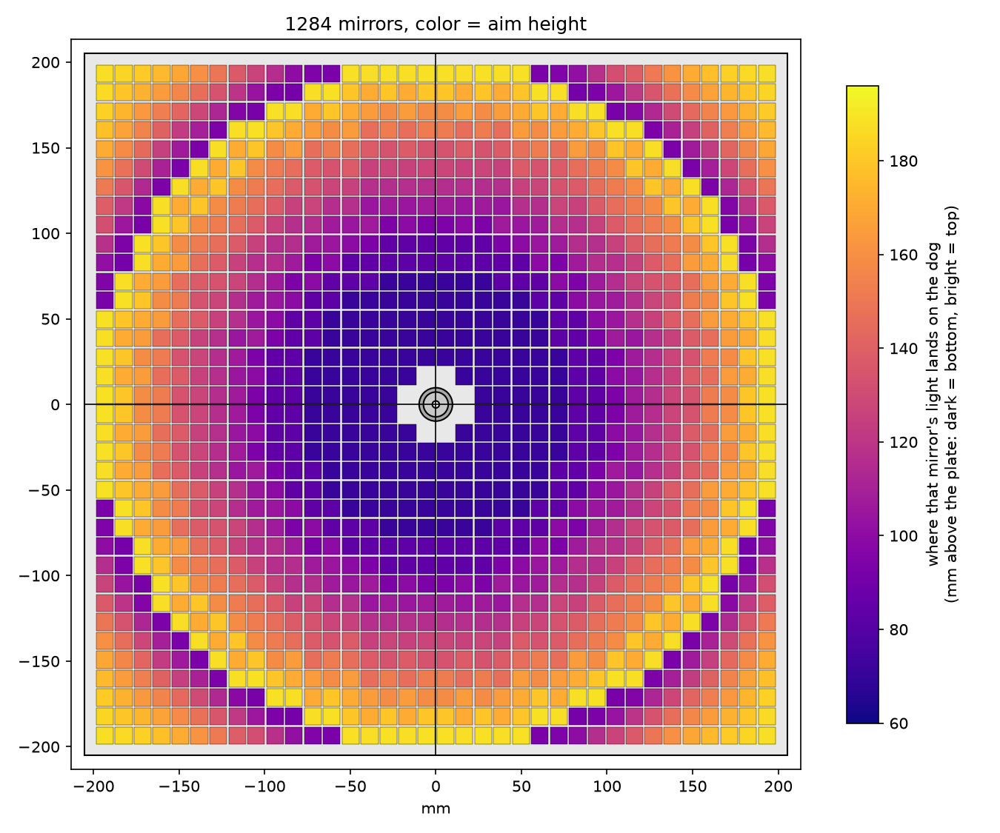
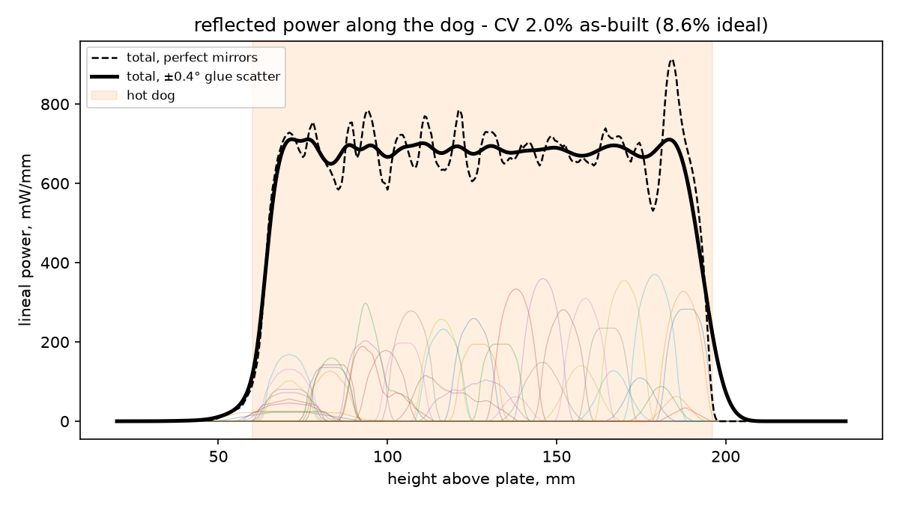
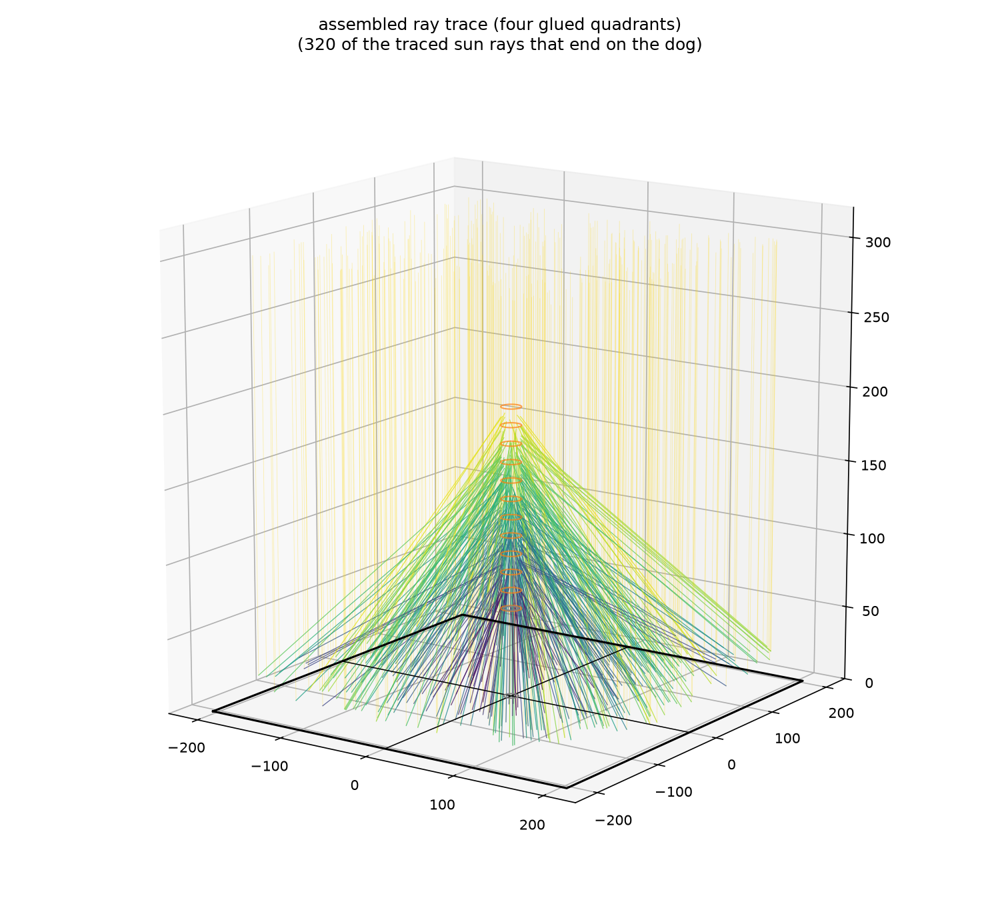
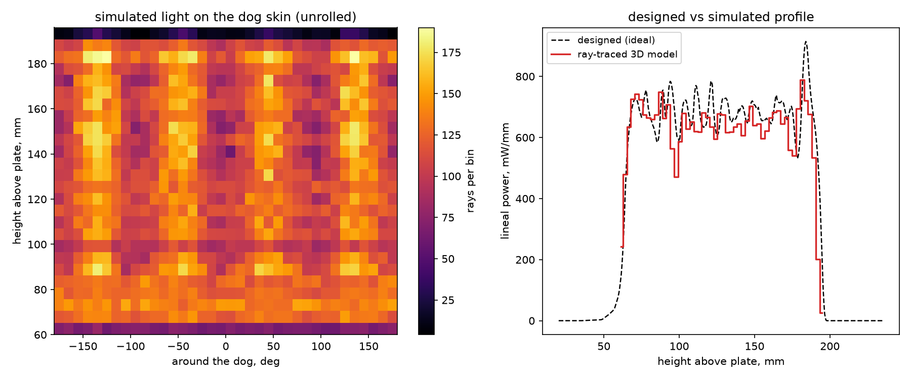
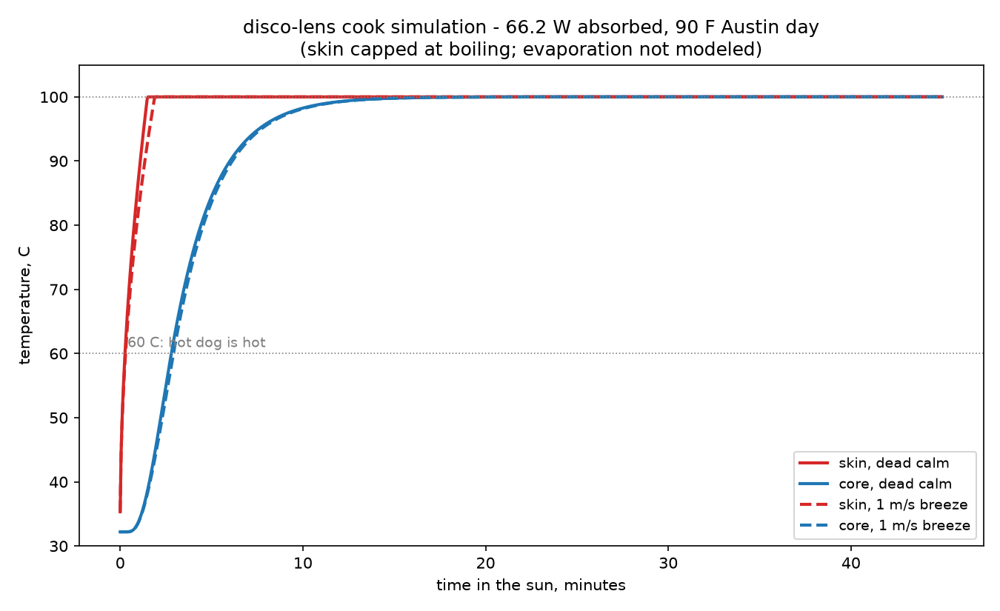

# disco-lens: a solar hot-dog cooker


A 3D-printed solar hot-dog cooker: plates you glue little mirrors onto,
each pad molded at the exact tilt that bounces its patch of sunlight
onto a hot dog seated on a central pedestal — angled so the light
spreads **evenly** along the whole sausage instead of scorching one
spot.

Four identical 205 mm quadrants printed FLAT (~10 h each), glued into
a 410 mm square. 1,284 mirrors, **84 W onto the dog** (ray-traced),
aimed for the measured Ø20×136 dogs.

It went through two earlier designs before this one: a single 205 mm
plate with a printed tilt screw (~22 W), and a 490 mm plate printed on
edge, which needed no supports but took ~18 h per part.

## What this example shows about SDM

- **Geometry that is the output of a physics model.** No pad tilt is
  drawn by hand. The optics solve each of 1284 tilts from the law of
  reflection and optimize the aim heights, and the SDF tree is built
  from that solution ([optics.py](src/disco_lens/optics.py) →
  [sdf_assembly.py](src/disco_lens/sdf_assembly.py)).
- **Symmetry instead of repetition.** Only one quadrant's seats are
  authored, wrapped in `canonical_sector_fold(n=4)`. The printed part
  is the full plate intersected with the x ≥ 0, y ≥ 0 box, so the
  quarter-pedestal and flat seam faces fall out of one tree.
- **Extending sdm-core without forking it.** A faster sector fold is
  registered into sdm-core's registries at import
  ([sdm_ext.py](src/disco_lens/sdm_ext.py)), and a test proves it gives
  the same field as stock sdm-core on the real trees.
- **A CEM a tool can drive.** [cem.toml](cem.toml) declares every
  parameter with units and bounds, `disco-lens-build --out --set` is
  the entry point a viewer re-runs when you drag a slider, and
  `scripts/check_contract.py` checks that from the outside.
- **Tests that probe the field.** The suite evaluates the compiled SDF
  at points whose answer is known by hand: no solid inside any mirror's
  glue-down envelope, seam planes clear, post and bore where they
  belong.

It is a self-contained project with its own `pyproject.toml`, so every
command in this file runs from this directory:

```bash
cd examples/emergent-matter-cem-hot-dog-cooker
uv sync --all-extras    # sdm-core and sdm-materials come from the org index
uv run pytest           # 271 tests, ~20 s
```

## How the math works

Everything follows from one picture: the plate is aimed at the sun, so
in plate coordinates every incoming ray is vertical. A flat mirror
tilted by angle **α** turns a vertical ray by exactly **2α** (law of
reflection). So for a mirror at radius *r* whose beam should land on
the dog at height *h*:

```
tan(2α) = (r − r_dog) / (h − z_mirror)
```

We aim at the dog's **near wall** (`r_dog` = 10 mm), not its centerline
— for the shallow inner mirrors that difference moves the landing spot
by tens of mm.

**Why even lighting is the hard part.** A 10 mm beam meeting the dog's
near-vertical surface smears into a stripe `~10·cos α / sin 2α` long.
Inner mirrors paint long faint stripes; outer ones short bright ones.
The sun's own half-degree width blurs every stripe, and each glued
mirror sits a few tenths of a degree off nominal, sliding its stripe by
`2·ε·D / sin 2α` — several cm for inner sites. The design problem:
choose each mirror's **aim height** so 1284 overlapping stripes sum
flat. Sites are binned into radius bands × checkerboard parity groups,
and a deterministic coordinate descent picks each group's aim to
flatten the **as-built** profile (every stripe convolved with realistic
±0.4° glue scatter). Each mirror's chosen aim height, seen from above:



The rings are the radius bands. Each band is split checkerboard-fashion
into two interleaved aim groups, because a dense band aimed at a single
height puts more light on that stretch of dog than the average, and no
choice of the other aims can flatten it back out.
Summed, the 1284 stripes give:



The whole design is then verified by ray-tracing the actual built
geometry — 168k sun rays against the SDF, including pad self-shadowing
that the stripe model can't see:





## Will it cook?

`scripts/thermal_sim.py` takes the ray-traced power, applies per-ray
Fresnel absorption at the skin (66 W absorbed on a 32 °C Austin day)
and runs a 1-D transient model of a 45 g dog:



The core passes 60 °C in about 3 minutes, dead calm or 1 m/s breeze.
Treat that as order of magnitude: the film coefficient is a guess and
the skin is capped at boiling because evaporation isn't modelled.

## The plate: four glued quadrants

Each printed plate is one quadrant of the assembled square and maxes a
Prusa bed on its own (205.2 mm + sight tab). The four prints are
IDENTICAL — print one file four times, glue the seam edges.

- **Quarter-pedestal per plate.** The center post (Ø14.5, skewer bore
  Ø4.1) is split into four quarter-columns that meet at the seams. A
  separately printed **clamp ring** (bore Ø15.1, OD Ø19.9 — still
  inside the dog's Ø20 shadow) slides over the assembled post and holds
  the quarters together; the dog seats on the post+ring top.
- **Fused pad field.** Each pad carries a wider collar recessed 1.5 mm
  below its mirror plane; collars overlap their neighbors, so every
  layer prints as one connected body instead of thousands of tiny
  islands (Rob's print-speed call). Mirror pitch, the 1 mm air gap
  between mirrors, and the pad-outline placement guide are unchanged.
  **Glass keep-outs** guarantee nothing — neighbor pad, collar, or the
  rim corner arc — rises into any mirror's glue-down envelope; the
  first plate printed had 12 seats where a neighbor corner overhung
  the glass by up to 0.22 mm, now impossible by construction (and
  regression-tested seat by seat).
- **Pedestal 60 mm + stadium seating.** At 410 mm the mid-field pads
  tilt ~30°, and a steep pad's raised edge pokes ~7 mm up — beams from
  the lower half of each mirror clip the next pad inboard (17% of
  mirror light, ray-traced, on the single-plate layout rules). A
  120 mm pedestal fixed it optically but stood the dog too high
  (Rob's call: 30–60 mm max). Recovery within that limit: mirrors ride
  a QUADRATIC stadium ramp, flat center rising to +20 mm at the corners
  (the raise gradient goes where the steep pads are — a linear ramp
  measured worse), plus a 0.45 aim-slope floor so far mirrors only take
  high targets.
- **One pinhole sight tab per quadrant** (single Ø9 boss, Ø1.4 bore):
  assembled, that's four sights, one per side. Bright dots below the
  bores = aimed.
- **No tilt screw.** The positioning mechanism is shelved for now. The
  earlier screw arm doesn't scale to this span.

## The numbers

| quantity | value |
|---|---|
| mirrors | 1284 (10.05 mm tiles), 36×36 grid, 321 per quadrant |
| assembled plate | 410.3 mm square, dog spans z = 60–196 mm |
| collecting aperture | 1297 cm² |
| onto the dog | 84.0 W after mirror loss (0.85 refl, 900 W/m²) |
| profile flatness | CV 2.0 % as-built along the dog |

(The ray trace books 10.3 % of aimed light as pad-blocked, but the
fused collars muddy that metric: their tilted tops act as accidental
extra mirrors whose stray reflections mostly get occluded — while a
little of it lands as bonus power. Watts on the dog is the honest
number: 84.0 W here vs 79.3 W before any of the blocking work.)

## Printing

- Generate the meshes with `uv run python scripts/export_stl.py`. They
  land in `stl/`, which is not tracked, and each export archives the
  previous one.
- Print `disco_lens_quadrant` **four times** + `disco_lens_ring`
  once. Flat side down, no supports. 0.2 mm layers, 3 walls, ~15 %
  infill.
- **PETG or ASA, not PLA** — a plate in full sun passes PLA's glass
  temperature and your mirrors slowly go cross-eyed. Light colors help.

## Assembly

1. Glue the four quadrants edge-to-edge (seam faces are flat); check
   the assembled square sits flat before the glue sets. Slide the clamp
   ring over the assembled pedestal, chamfered bore down, flush with
   the top.
2. Glue a 10.05 mm mirror tile flat onto every pad — the pad outline is
   the placement guide (0.2 mm ledge). Small uniform blob of
   silicone/E6000, press to a thin glue line. **Seating accuracy
   matters most near the center**; out at the corners it barely
   matters. [mirror_table.csv](layout/mirror_table.csv) has every
   mirror's position, tilt and aim.
3. Skewer: round 4 mm steel, ≥260 mm long, down the Ø4.1 center bore
   (ream to fit). Impale the dog and seat it on the pedestal.

**Mind your eyes.** 1284 mirrors converging is ~85 W at the focus —
nearly four times the single-plate version. Don't put your face near
the dog zone, don't leave it aimed unattended, and cover it or aim it
at the sky between dogs.

## Changing the design

All dimensions live in
[parameters.py](src/disco_lens/parameters.py) (`DiscoLensParameters`),
and [cem.toml](cem.toml) declares the same surface machine-readably:
every param with its unit, bounds, what a change costs, and the name
it carries in the `.sdm`. Change one and not the other and
`test_manifest.py` fails, in both directions. After changing anything:

```bash
uv run python scripts/build.py              # re-optimizes, rewrites .sdm/CSV/plots
uv run python scripts/export_stl.py         # re-meshes the STLs
uv run python scripts/simulate_rays.py      # ray-trace the assembled cooker
uv run python scripts/thermal_sim.py        # will it cook?
uv run pytest                               # sanity: optics + printed geometry agree
uv run python scripts/check_contract.py     # sanity: a tool can still drive it
```

For a single part without the plots and the CSV, the CEM entry point
takes overrides directly:

```bash
uv run disco-lens-build --out quadrant.sdm --set mirror_size=10.2 --optimize
```

It reuses the solved aims in
[mirror_table.csv](layout/mirror_table.csv) unless `--set` moves
the mirror layout, which is what `--optimize` is for. The whole thing
takes a couple of seconds: the aim solve is 1.4 s for 1284 sites.

## Renders

The picture at the top is a Blender render of the real geometry: the
exported quadrant mesh placed four times, and every mirror posed from
[mirror_table.csv](layout/mirror_table.csv). It is presentation only;
nothing in [renders/](renders/) is needed to build the part.

```bash
uv run python scripts/export_stl.py                 # the plate mesh it places
uv run python renders/scene.py                      # mirror poses -> scene.json
blender --background --python renders/render.py     # -> renders/hero.png, under 30 s on a GPU
magick renders/hero.png -alpha off -colors 256 -dither FloydSteinberg \
    PNG8:renders/hero.png                           # 256-colour palette, ~130 KB
```

Leave out `--background` to open the same scene on the hero camera and
orbit it.
