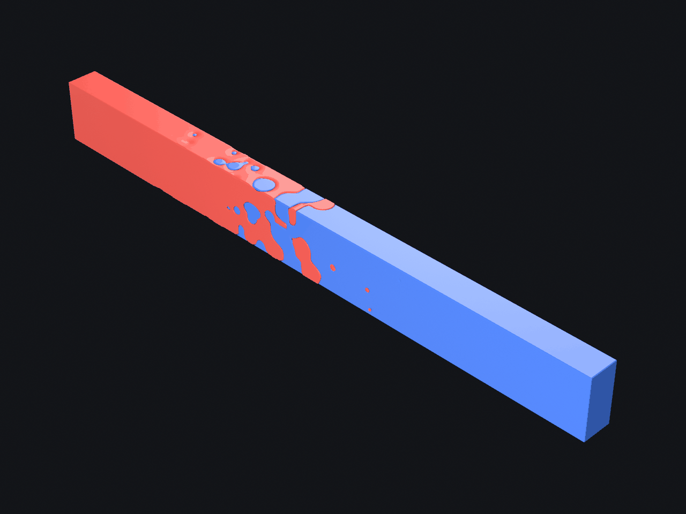

# Multi-material diffusion bar

A **CEM** — a computational engineering model: parameters in, geometry out.
It lives in `examples/` rather than its own repo, but it is named to the
[`emergent-matter-cem-*`](../../../engineering-playbook/conventions/naming.md)
convention so promoting it later is a move, not a rename.

A worked example of authoring a **functionally graded, two-material,
monolithic** part with [`sdm-core`](../../../emergent-matter-sdm-core) —
composition as a designed field rather than an assembly of two parts.



A 200 × 20 × 20 mm bar is one solid piece made of two materials — **red** and
**blue**. Across the weld the two interpenetrate as a *diffusion zone*: a
stochastic dispersion of each material reaching into the other, coarse and
dense at the interface, thinning to isolated fine particles until each end is
pure.


> **Copying this as a starting point?** Use
> [`emergent-matter-sdm-cem-template`](../../../emergent-matter-sdm-cem-template)
> instead. This example is deliberately **one file** so it can be read top to
> bottom; a real CEM separates the design (`parameters.py`, which imports
> nothing from sdm-core), the trees, the assembly, the harness and the CLI, and
> that separation is where its tests attach. This follows the template's
> *rules* — `cem.toml`, no derived values as free params, `validate()`
> returning a list, a cheap generator — and declines only its file layout, for
> demonstration purposes. The template is the source of truth.

## The physics it is rooted in

**This is not a diffusion simulation.** It uses the closed-form solution of
Fick's second law as a *composition target* and realises that target as
geometry — no time stepping, no solver.

Two bars bonded at `x = 0` and held hot interdiffuse. The composition profile
is the error-function solution:

```
phi(x) = ½ · erfc( x / L )        L = 2·sqrt(D·t)
```

`L` is the **penetration depth** — the single length that sets how far mixing
reaches. That is the `reach_mm` slider.

Real couples are **asymmetric**. The two species have different intrinsic
diffusivities, so one crosses the weld more readily than the other — copper
into brass, water into a polymer. The consequences are textbook (Darken,
Kirkendall): the faster species penetrates further and the profile is lopsided
about the original weld. `balance` is that ratio on a log scale:

```
D_red / D_blue = 16 ^ balance
L_red  = reach · (D_red/D_blue) ^  ¼
L_blue = reach · (D_red/D_blue) ^ -¼
```

Depths are normalised so their *geometric mean* stays `reach` — sliding
`balance` redistributes reach between the species rather than adding total
mixing, so the control does exactly one thing. The build prints the **Matano
shift**, the offset of the plane that balances the two transported volumes.

## From composition field to geometry

A volume fraction is not printable on its own; it has to become a shape.

Sites are laid on a jittered lattice through the mixing zone. At each site the
**minority** material is placed with a probability set by its local volume
fraction, and the particle's radius is graded between that material's min and
max size by the same fraction.

The occupancy is not simply `phi`. Independently placed particles form a
**Boolean (Poisson) model**, whose covered fraction is `1 − exp(−n·V)`, *not*
`n·V` — overlap saturates coverage, and near the weld the two differ by more
than 2×. Inverting the right law is what makes the realised profile track the
analytic one; using `n·V` drowns the weld and empties the fringe several
depths too early.

`build.py` prints the realised profile against the analytic target so the
match is measured rather than asserted:

```
      x (mm)   realised            target
     -16.2  0.811 ###################      0.811
     -10.8  0.684 ################         0.722
      -5.4  0.573 ##############           0.616
      -0.0  0.540 #############            0.500
      +5.4  0.439 ###########              0.384
     +10.8  0.253 ######                   0.278
     +16.2  0.170 ####                     0.189
```

The far tail undershoots on purpose: a particle whose graded radius lands under
the 300 µm floor is not emitted at all, rather than printed as a feature no
process can hold.

## How it stays monolithic

An earlier version kept red and blue as two symmetric expressions and relied on
their beads never overlapping — a spacing constraint — to stay a clean
partition. **A stochastic dispersion overlaps constantly**, so that
construction cannot hold. This one defines a single blob and takes blue as its
exact complement inside the bar:

```
red_blob = (left block ∪ red particles) − blue particles
red      = bar ∩ red_blob
blue     = bar − red_blob
```

Inside the bar a point is in red iff `red_blob` is negative there and in blue
iff it is positive, so the two tile the bar exactly — no voids, no overlap, no
spacing constraint, **for any particle arrangement whatsoever**. `build.py`
verifies it by sampling the interior.

Where a red and a blue particle overlap the subtraction gives the region to
blue. That is a real (small) bias at the weld, and it is visible in the printed
profile rather than hidden.

### One consequence of the exact partition, in the MESH

`blue = bar − red_blob` is `max(d_bar, −d_blob)`. At red's boundary `d_blob`
is 0, so blue's field there is `max(d_bar, 0) = 0` — **blue's zero-set contains
red's entire boundary**, with no interior behind it. Marching cubes both
regions at iso 0 therefore emits a blue surface lying exactly on every red
surface: a zero-thickness sheet wrapping the whole red block. It shattered into
**367,831 connected components for 356,195 vertices**, and in a viewer the
coincident surfaces z-fight — red particles breaking the skin rendered as
hollow blue rings, which looks like a modelling bug and is not one.

`BLUE_ISO_BIAS_MM = -0.05` meshes blue a quarter-voxel inside itself. The sheet
disappears (94 components), and the interface carries a 0.05 mm gap — a quarter
of the sampling resolution, well under the 300 µm manufacturability floor.

**The `.sdm` keeps the exact partition.** This is a property of the mesh, which
is a lossy view of the field, and it is the mesh that has to be rendered.

## Parameters

`coalescence_mm` is the `k` of every smooth union/subtract, emitted as a **live
GLSL uniform** — it scrubs in real time and controls how far particles melt
into each other and into the bulk: the difference between a bag of marbles and
a genuine alloy.

Every other parameter changes how many spheres are emitted, which is topology.
No emitter can infer that from an already-stamped tree, so they carry
`ui.role = "topology"` and the `.sdm` ships a `metadata.generator` telling a
viewer how to re-run this script. Moving one rebuilds the part (seconds)
instead of scrubbing a uniform (milliseconds).

| parameter | unit | default | what it does | tier |
|---|---|---|---|---|
| `coalescence_mm` | mm | 2.4 | how far particles melt together | **live** |
| `reach_mm` | mm | 34 | penetration depth `L = 2√(Dt)` | rebuild |
| `balance` | ratio | 0 | `D_red/D_blue` on a log scale; ± favours one species | rebuild |
| `sprawl` | ratio | 0.7 | 0 = rigid lattice, 1 = fully stochastic scatter | rebuild |
| `density` | ratio | 1.25 | lattice site density — the particle budget | rebuild |
| `red_min_mm` / `red_max_mm` | mm | 0.4 / 4.0 | red particle size range | rebuild |
| `blue_min_mm` / `blue_max_mm` | mm | 0.4 / 4.0 | blue particle size range | rebuild |
| `seed` | count | 7 | scatter seed; the build is deterministic in it | rebuild |

Cost note: every particle is another call in the scene function's smooth-union
fold, evaluated at **every march step**. The default lands at 342 spheres;
`build.py` warns past 350. Meshing offline can afford far more than an
interactive session can.

## The declared surface

[`cem.toml`](cem.toml) is what a tool reads when handed this directory, and it
is read **without importing anything** — an MCP server's `read_cem` parses it and
never resolves `entry_point`. Every param carries its type, default, unit,
`role`, bounds, the name it `emits` in the `.sdm`, and a `doc`.

Derived values are **not** declared there. The per-species penetration depths,
the Matano shift, the zone extent and the particle counts are computed from the
declared fields and never ship as free params. Flattening a derived value into
an independent param is the hexafoil bug: the two desync the moment a slider
moves, and the viewer renders the inconsistent state faithfully because nothing
errors.

### `validate()` returns a list. It does not raise.

An earlier version of this CEM **clamped** out-of-range input and silently
swapped an inverted size range. That is worse than either accepting or
refusing: you send `reach_mm=90`, get 80, and nothing anywhere says so — the
viewer then shows a slider position that does not describe the part in front
of it. Range checking now lives in `validate()`, which returns every problem at
once so an optimiser or an agent sees them in one pass rather than one per
round trip. `main()` is what refuses, with a non-zero exit and the reasons on
stderr:

```
$ build.py --set reach_mm=200 --set sprawl=9 --set red_min_mm=5 --set red_max_mm=1
3 constraint(s) violated:
  - reach_mm_within_bounds: reach_mm=200 is outside [3, 80]
  - sprawl_within_bounds: sprawl=9 is outside [0, 1]
  - red_size_range_ordered: red_min_mm=5 >= red_max_mm=1, which is not a range
```

Because that goes to stderr with a non-zero exit, the reason survives the trip
through the viewer's subprocess and lands in the browser instead of a bare
"authoring failed".

The two interesting constraints are the ones no per-param bound can express:
`{red,blue}_particle_fits_its_gradient` compares a declared size against a
**derived** depth that depends on `reach_mm` *and* `balance` together — and
since `balance` drives the two depths in opposite directions, a balance slide
alone can violate it on one side while the other stays fine.

## Run it

Geometry + meshes (writes `bar.sdm`, the four STLs, `manifest.json`) — run
against the sdm-core venv:

```bash
../../../emergent-matter-sdm-core/.venv/bin/python build.py
```

Override any parameter, and write somewhere else:

```bash
... build.py --set reach_mm=40 --set balance=0.6 --out /tmp/hot.sdm
... build.py --no-mesh          # .sdm only, skip the STLs
... build.py --seed             # start from an existing .sdm's values
```

## Pictures

Everything visual lives in [`renders/`](renders/), and **nothing in there is
needed to build the part** — `build.py` and `cem.toml` are the CEM and know
nothing about cameras. One script, two modes, chosen by how Blender starts:

```bash
# headless -> renders/hero.png
blender --background --python renders/render.py

# interactive -> viewport on the hero camera, yours to orbit
blender --python renders/render.py
```

| env | effect |
|---|---|
| `SDM_VIEW=solid` | the whole monolithic bar instead of the `y ≥ 0` cutaway |
| `SDM_HERO_CAM=ortho` | orthographic instead of perspective |
| `SDM_HERO_OUT=path` | where the headless render lands |

It reads `manifest.json` and the STLs it names, so run `build.py` first.

Both camera modes sit at the same **isometric angle** — Euler (54.736°, 0, 45°), where
54.736 is `atan(1/√2)`, the elevation that projects the three axes 120° apart
with equal foreshortening. They differ only in projection, so they are directly
comparable:

| `SDM_HERO_CAM` | what it gives you |
|---|---|
| `persp` (default) | The bar reads as an object. The long axis recedes, so the near end is visibly larger — depth the eye can use. |
| `ortho` | The technical read. Equal foreshortening everywhere, so a particle's size is *purely* its composition and never its distance. |

Framing is computed, not dialled in: the script measures the subject's
projected extent from the real mesh bounds and solves for the camera distance
(or `ortho_scale`) that fills `FILL` of the frame width, aiming at the
geometry's own centre. That matters because the `y ≥ 0` cutaway is not centred
on the origin, and red and blue reach different distances once `balance` is off
zero — a hard-coded frame silently mis-centres every variant but the default.

## Files

Checked in:

| file | what |
|------|------|
| `build.py`        | authors the part, verifies it's monolithic, writes `.sdm` + STLs |
| `cem.toml`        | the declared surface: params, roles, bounds, constraints |
| `renders/render.py` | the picture-making, headless or interactive. Not needed to build the part |
| `renders/hero.png`  | the image at the top of this file |
| `bar.sdm`         | the part itself — open it in a viewer without building anything |

Generated, and therefore **git-ignored** — nothing here is a source of truth:

| file | recreate with |
|------|------|
| `*.stl`, `manifest.json` | `build.py` (a few minutes — it is meshing at 0.2 mm) |
| `bar_glsl/`       | the viewer, or `python -m software_defined_matter.glsl bar.sdm` |
| `renders/*.png` (except `hero.png`) | `blender --background --python renders/render.py` |

`bar.sdm` **is** checked in, unlike everything above. The whole point of the
format is that a tool can open one without a toolchain, and making the
example's own subject the one thing you cannot see without a build would be a
strange way to demonstrate that. Note that a viewer rewrites it in place as
you move sliders — that is the rebuild contract working — so expect it
modified after a session, and `git checkout` it if you did not mean to keep
the change.
